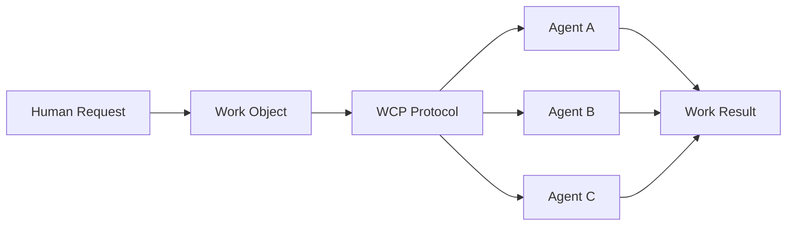
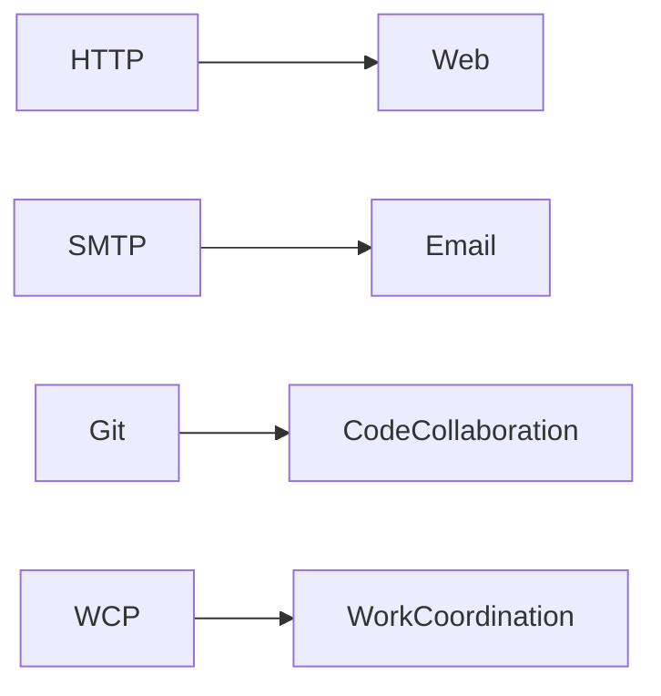

# Work Coordination Protocol (WCP)

<p align="center">
  
</p>

## The Missing Coordination Layer for AI Agents



WCP introduces a universal coordination layer where work can be created,
discovered, claimed, and executed by autonomous agents.

## Why WCP?



**WCP** is an open protocol for coordinating work between **humans, AI agents, and software systems**.

It defines a universal abstraction for:

* Work objects
* Agent capabilities
* Work lifecycle states
* Event-driven execution

The goal of WCP is to enable **open ecosystems where humans and autonomous agents can collaborate across systems.**

---

## Motivation

Modern AI agents are increasingly capable of executing complex tasks.

However, most agent systems operate in **isolated environments**, preventing collaboration across applications and platforms.

WCP proposes a minimal protocol that enables:

* work creation
* work discovery
* work claiming
* work execution
* work completion

across heterogeneous systems.

---

## Core Concepts

WCP defines four primitives:

```
Work
Agent
Capability
Event
```

---

## Work Lifecycle

```
created → ready → running → completed
                      ↘
                       failed
```

---

## Example Work Object

```json
{
  "work_id": "work_123",
  "type": "email.send",
  "status": "ready",
  "priority": "medium",
  "context": {
    "to": "alice@example.com",
    "subject": "Meeting Reminder"
  }
}
```

---

## Repository Structure

```
whitepaper/   → protocol overview
proposals/    → formal protocol specifications
examples/     → JSON examples
diagrams/     → system diagrams
reference/    → reference implementations
```

---

## Status

WCP is currently **Draft v0.1**.

This repository contains the initial whitepaper and protocol proposals.

Contributions and discussion are welcome.
