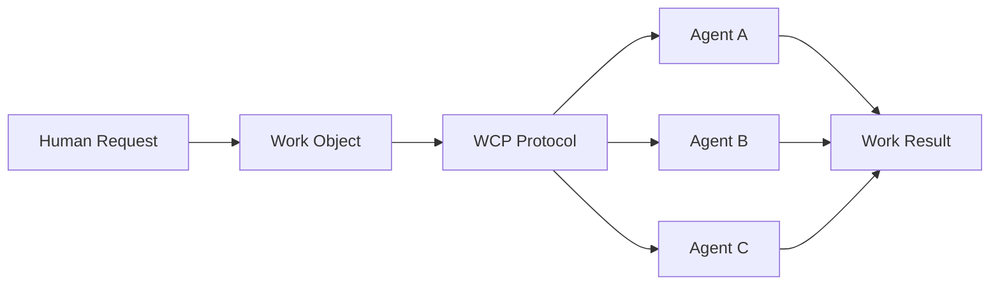
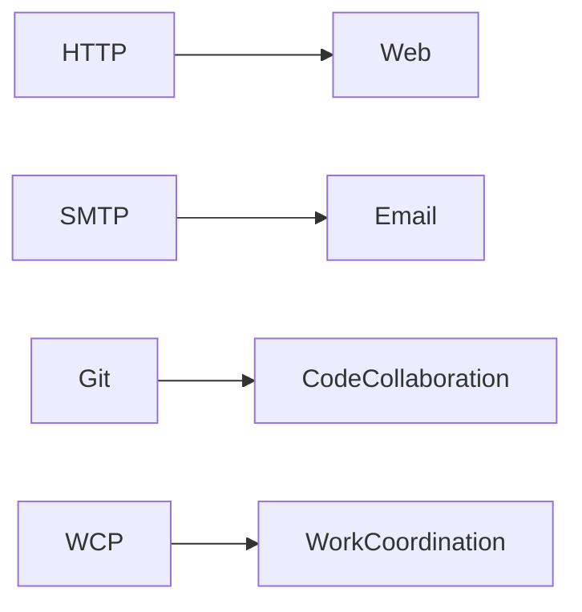
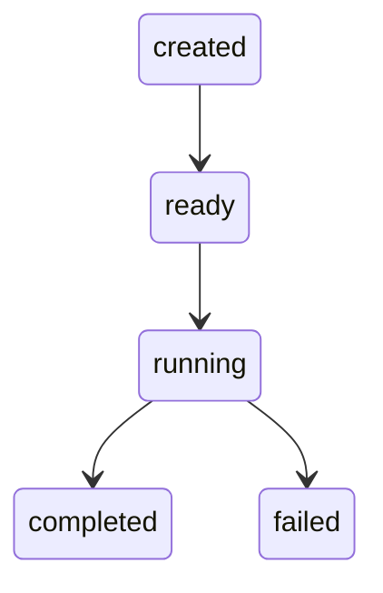
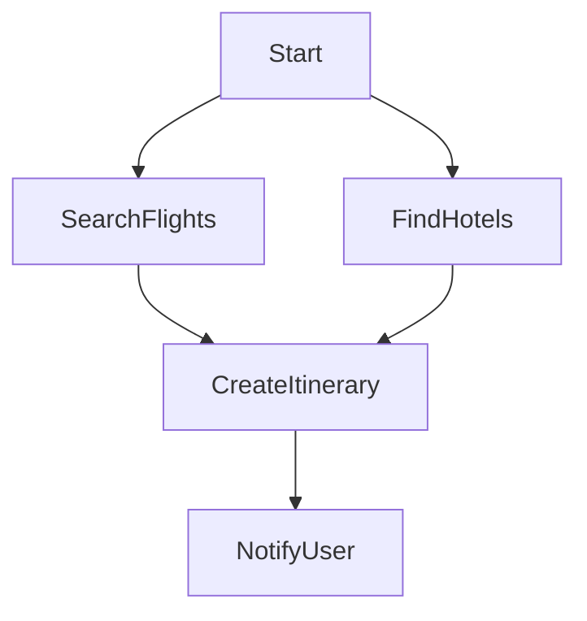
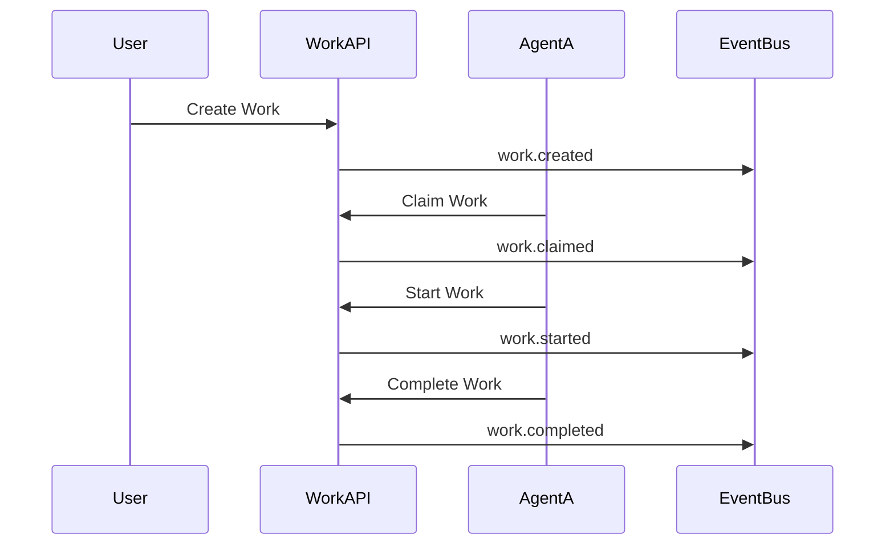

<p align="center">
  
</p>

<h1 align="center">Work Coordination Protocol (WCP)</h1>

<p align="center">
An open protocol for coordinating work between humans, AI agents, and software systems.
</p>

<p align="center">


</p>

---

# The Missing Coordination Layer for AI Agents



WCP introduces a universal coordination layer where **work becomes the primitive unit of collaboration** between humans and autonomous agents.

Using WCP, work can be:

* created
* discovered
* claimed
* executed
* completed

by distributed systems and AI agents.

---

# Why WCP?



Just as other protocols standardized communication layers, **WCP proposes a standard for coordinating executable work.**

As AI agents become more capable, systems require a **shared coordination protocol** that allows work to move across platforms.

---

# Core Concepts

WCP defines four fundamental primitives.

| Primitive      | Description                       |
| -------------- | --------------------------------- |
| **Work**       | Unit of executable work           |
| **Agent**      | Entity capable of executing work  |
| **Capability** | Type of work an agent can perform |
| **Event**      | Lifecycle notifications           |

Example work object:

```json
{
  "work_id": "work_123",
  "type": "email.send",
  "status": "ready",
  "context": {
    "to": "alice@example.com",
    "subject": "Meeting Reminder"
  }
}
```

---

# Work Lifecycle



Lifecycle states:

* **created** – work registered
* **ready** – work available for execution
* **running** – agent executing
* **completed** – execution finished
* **failed** – execution unsuccessful

---

# Work Graphs (Workflow Dependencies)



WCP supports **multi-step workflows** through work graphs where tasks depend on the completion of other tasks.

---

# Multi-Agent Coordination



Agents coordinate execution through **event-driven communication**.

---

# Protocol Specifications

The protocol is defined through proposal documents.

| Spec          | Description                  |
| ------------- | ---------------------------- |
| **WCP-P0001** | Work Object Specification    |
| **WCP-P0002** | Work Lifecycle               |
| **WCP-P0003** | Agent Capability Declaration |
| **WCP-P0004** | Event Messaging              |
| **WCP-P0005** | Work Claiming & Scheduling   |
| **WCP-P0006** | Work Graphs                  |
| **WCP-P0007** | Authentication & Security    |
| **WCP-P0008** | Capability Discovery         |

See the **`proposals/`** directory for details.

---

# Reference Implementation

A minimal reference server is included using **FastAPI**.

Location:

```
reference/wcp-fastapi-server
```

Features:

* work creation
* work claiming
* lifecycle updates
* agent registration
* capability discovery
* event emission

Run locally:

```bash
pip install -r requirements.txt
uvicorn app.main:app --reload
```

API documentation:

```
http://localhost:8000/docs
```

---

# Repository Structure

```
wcp-protocol
│
├── docs
│   └── logo.svg
│
├── whitepaper
│   └── wcp-whitepaper-v0.1.md
│
├── proposals
│   ├── WCP-P0001-work-object.md
│   ├── WCP-P0002-work-lifecycle.md
│   ├── WCP-P0003-agent-capabilities.md
│   ├── WCP-P0004-event-messaging.md
│   ├── WCP-P0005-work-claiming-scheduling.md
│   ├── WCP-P0006-work-graphs.md
│   ├── WCP-P0007-authentication-security.md
│   └── WCP-P0008-capability-discovery.md
│
├── diagrams
│
├── examples
│
└── reference
```

---

# Status

```
Protocol Status: Draft v0.1
```

WCP is currently an early-stage protocol proposal.

The specification may evolve as feedback and implementations emerge.

---

# Contributing

Contributions are welcome.

Ways to contribute:

* propose new protocol specifications
* improve documentation
* build SDKs or implementations
* provide feedback on design decisions

Open an issue or submit a pull request.

---

# License

MIT License.

---

# Vision

WCP explores a simple idea:

> **What if "work" became the universal coordination primitive for AI systems?**

If successful, WCP could become a foundational layer for **human–AI collaboration across the internet**.
