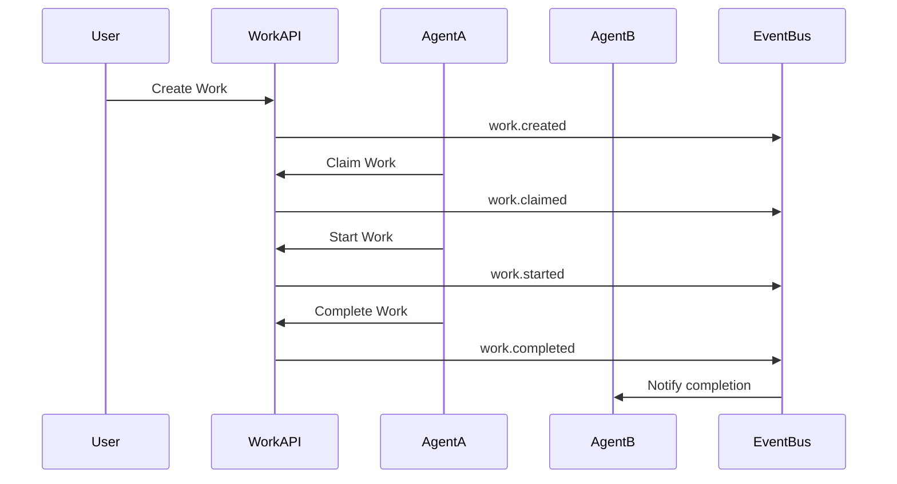

# Multi-Agent Coordination

```mermaid
sequenceDiagram

participant User
participant WorkAPI
participant AgentA
participant AgentB
participant EventBus

User->>WorkAPI: Create Work
WorkAPI->>EventBus: work.created

AgentA->>WorkAPI: Claim Work
WorkAPI->>EventBus: work.claimed

AgentA->>WorkAPI: Start Work
WorkAPI->>EventBus: work.started

AgentA->>WorkAPI: Complete Work
WorkAPI->>EventBus: work.completed

EventBus->>AgentB: Notify completion
```

## Description

This diagram shows how agents coordinate execution through event messaging.

Agents observe lifecycle events and react accordingly.
