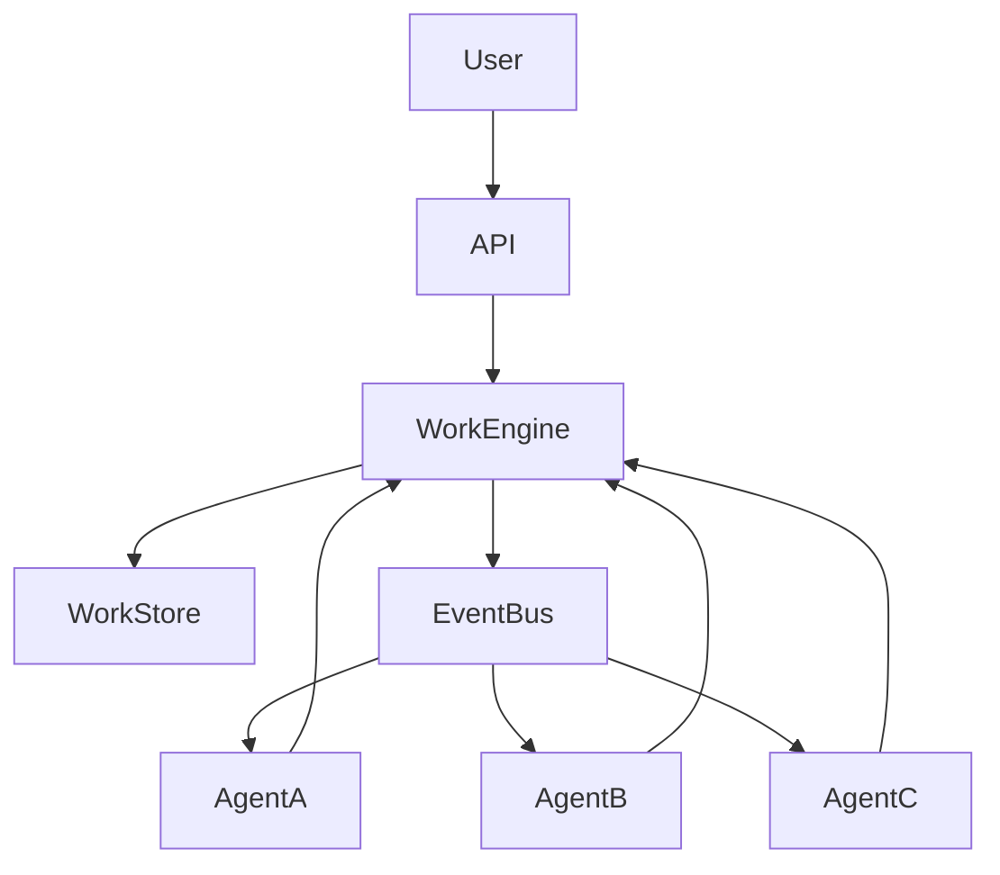

# WCP System Architecture

## Description

The WCP architecture consists of several components:

* **User Interface** – where work requests originate
* **Work API** – entry point for creating and managing work objects
* **Work Engine** – manages lifecycle and scheduling
* **Work Store** – persistent storage for work objects
* **Event Bus** – distributes lifecycle events
* **Agents** – autonomous systems executing work
