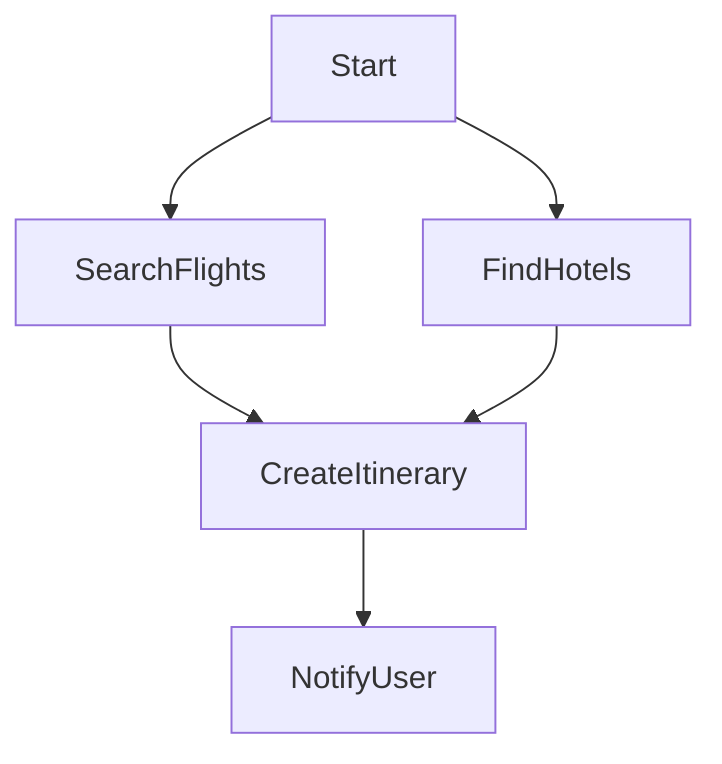

# Work Graph (Dependencies)

## Description

Work Graphs allow complex workflows where work objects depend on other work objects.

Key concepts:

* **Parallel execution** for independent tasks
* **Dependency resolution** before execution
* **Multi-agent collaboration**
