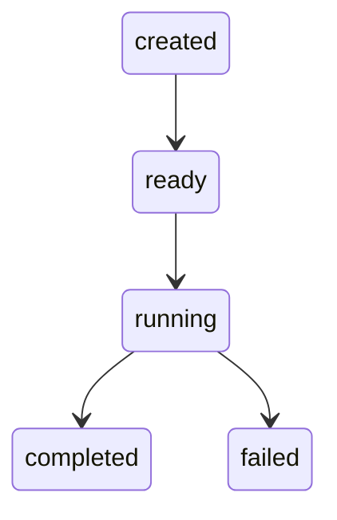

# Work Lifecycle

## Description

The lifecycle describes the standard state transitions of a work object:

* **created** – work registered
* **ready** – work available for execution
* **running** – agent executing
* **completed** – execution finished
* **failed** – execution unsuccessful
